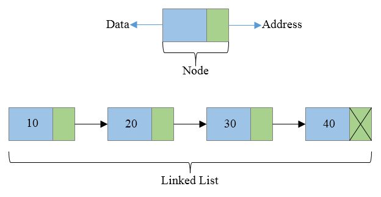
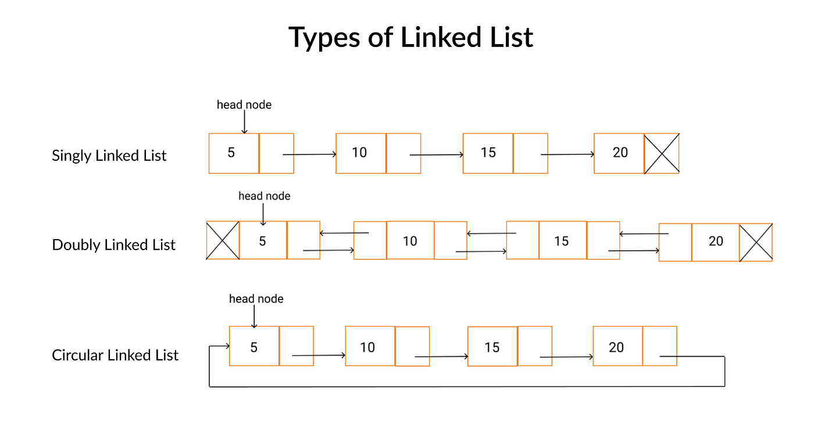

import Tabs from '@theme/Tabs';
import TabItem from '@theme/TabItem';

# Module 3: Data Structures that Actually Matter

---

## 3-1 Stateless vs Stateful

**Stateful** When the code hold the previous information in the multiple iteration
**Stateless** if can't hold then it is stateless

In general `Function` is stateless and `Object` is stateful

**Lexical Environment:** lexical environment is local environment and the reference of outer environment

<Tabs>
  <TabItem value="stateless" label="Stateless" default>
```js showLineNumbers
function counter(amount){
    let count = 0;
    return count + amount;
}

counter(2) // 2
counter(3) // 3

````
  </TabItem>
  <TabItem value="stateful" label="Stateful">
  ```js showLineNumbers
  const counter = {
    count: 0,
    add(amount){
        this.count = this.count + amount;
    },
    print(){
        console.log(this.count)
    }
  }

counter.add(2);
counter.add(3);
counter.print() // 5
````

  </TabItem>
</Tabs>

## 3-2 Basic Class constructor and methods refresher

### Pure Function:

It will always return the same output for the same input.

### Closer

**Closure:**  
A closure in JavaScript is when a function remembers the variables from its outer scope even after that scope has finished executing.  
Closures let you access and use those variables later.

```js
const createCounter = () => {
    let count = 0;

    return (amount) => {
        count = count + amount;
        return count;
    };
};

const counter = createCounter();
console.log(counter(3)); // 3
console.log(counter(5)); // 8
```

In this example, the inner function still has access to the `count` variable even after `createCounter` has finished running.

### Class

Class is just like a template. From class we can create object as many as we want.

```js
class Counter {
    constructor(count) {
        this.count = count;
    }

    add(amount) {
        this.count = this.count + amount;
    }

    print() {
        console.log(this.count);
    }
}
const counter1 = new Counter(0);
counter1.add(2); // 2
counter1.add(3); // 5
```

## 3-3 Stack Implementation using Array

### Stack

**Stack** is a data stricture that follow Last In First Out **(LIFO)** principle.

It store data one top of another. it has three methods

-   **push**: To add new element to a stack
-   **pop**: To remove the last element of a stack
-   **peek**: To see the last element of a stack with out remove it

```js title="Stack Implementation" showLineNumbers {6-23}
class Stack {
    constructor() {
        this.items = [];
    }
    // O(1)
    push(data) {
        this.items.push(data);
    }
    // O(1)
    pop() {
        if (this.isEmpty()) {
            return undefined;
        }
        return this.items.pop();
    }
    // O(1)
    peek() {
        if (this.isEmpty()) {
            return undefined;
        }
        index = this.items.length - 1;
        return this.items[index];
    }
    // O(1)
    isEmpty() {
        return this.items.length === 0;
    }
    // O(n + n + n) -> O(3n) -> O(n)
    print() {
        console.log(this.items.slice().reverse().join(" -> "));
    }
}
const stack = new Stack(); // create new stack
stack.push(10); // add 10
stack.push(20); // add 20
stack.pop(); // last element 20 remove
stack.peek(); // 10
```

## 3-4 Queue Implementation using Array

### Queue

**Queue** is a data structure that follow First In First Out **(FIFO)** principle. It has two methods:

-   **enqueue**: Insert a element in a queue.
-   **dequeue**: Remove the first element of a queue
-   **front/peek**: View the front (or first) element of a queue.

```js title=Queue Array Implementation
class Queue {
  constructor() {
    this.items = [];
  }
  //O(1)
  enqueue(element) {
    this.items.push(element);
  }
  O(n)
  dequeue() {
    if (isEmpty()){
      return undefined
    }
    return this.items.shift();
  }
  // O(1)
  front() {
    if(isEmpty()){
      return undefined
    }
    return this.items[0];
  }
  // O(1)
  isEmpty(){
    return this.items.length === 0
  }
}
const queue = new Queue()
```

## 3-5 Linked-list - A Visual Representation

In linked list, it is a list of nodes and each nodes can contain value and can connect in next node and previous node using pointer.

-   **Head**: If the node does not have any previous node pointer then it is first node or head.

-   **Tail**: If the node does not have any last node pointer then it is last node or tail.

-   **Node**: combined of data and next (pointer address of next node)



## 3-6 Linked List Implementation - Basic concept of Node



```js title="Basic Linked list" showLineNumbers
class Node {
    constructor(value) {
        this.value = value;
        this.next = null;
    }
}
const head = new Node(10);
head.next = new Node(20);
head.next.next = new Node(30);

// print linked list
let temp = head;
while (temp !== null) {
    console.log(temp.value);
    temp = temp.next;
}
```

## 3-7 Linked List Implementation - append() and print()

```js showLineNumbers {16-28,36-45}
class Node {
    constructor(value) {
        this.value = value;
        this.next = null;
    }
}

class Linkedlist {
    constructor() {
        this.head = null;
        this.tail = null;
        this.length = null;
    }

    // add vlue at the end of the list like push
    append(value) {
        const newNode = new Node(value);
        // if Linkedlist is empty
        if (this.head === null) {
            this.head = newNode;
            this.tail = newNode;
        } else {
            // if Linkedlist is not empty
            this.tail.next = newNode;
            this.tail = newNode;
        }
        this.length++;
    }

    prepend() {}

    insert() {}

    remove() {}

    print() {
        let currentNode = this.head;
        const arr = [];

        while (currentNode !== null) {
            arr.push(currentNode.value);
            currentNode = currentNode.next;
        }
        console.log(arr.join(" -> "), "-> null ");
    }
}

const list = new Linkedlist();
list.append(5);
list.append(6);
list.print();
```

## 3-8,9,10 prepend(), insert(), remove()

```js showLineNumbers {15-30,33-43,45-60,73-98}
class Node {
    constructor(value) {
        this.value = value;
        this.next = null;
    }
}

class LinkedList {
    constructor() {
        this.head = null;
        this.tail = null;
        this.size = 0;
    }

    append(value) {
        const newNode = new Node(value);

        // if list is empty
        if (!this.head) {
            this.head = newNode;
            this.tail = newNode;
        } else {
            // if list is not empty
            this.tail.next = newNode;
            this.tail = newNode;
        }
        this.size++;
        // append(value).append(value)
        return this;
    }

    // add value in begening of list like shift in js
    prepend(value) {
        if (!this.head) {
            this.append(value);
            return this.size;
        } else {
            const newNode = new Node(value);
            newNode.next = this.head;
            this.head = newNode;
            return ++this.size;
        }
    }

    insert(index, value) {
        if (index < 0 || index > this.size) {
            console.log("Index out of bound");
            return undefined;
        } else if (index === this.size) {
            this.append(value);
        } else if (index === 0) {
            this.prepend(value);
        }
        const newNode = new Node(value);

        let leadingNode = this._traversToIndex(index - 1);
        newNode.next = leadingNode.next;
        leadingNode.next = newNode;
        return ++this.size;
    }

    // Private Helper Function
    _traversToIndex(index) {
        let count = 0;
        let current = this.head;
        while (count !== index) {
            current = current.next;
            count++;
        }
        return current;
    }

    remove(index) {
        if (index < 0 || index >= this.size) {
            console.error("Index out of bound");
            return undefined;
        }
        if (!this.head) {
            console.error("Linked List is empty");
            return undefined;
        }
        if (index === 0) {
            this.head = this.head.next;
            if (this.size === 1) {
                this.tail = null;
            }
            this.size--;
            return;
        } else {
            const leadingNode = this._traversToIndex(index - 1);
            leadingNode.next = leadingNode.next.next;
            if (leadingNode.next === null) {
                this.tail = leadingNode;
            }
            this.size--;
            return;
        }
    }

    print() {
        let current = this.head;
        let result = "";

        while (current) {
            result = result + current.value + " => ";
            current = current.next;
        }
        result += "null";
        console.log(result);
    }
    size() {
        return this.size;
    }
}

const roll = new LinkedList();

roll.append(10);
roll.append(20);
roll.append(30);
roll.append(40);
roll.append(50);
roll.print();
roll.remove(roll.size - 1);
roll.print();
roll.remove(0);
roll.print();
```

## 3-10 Queue Implementation with Linked List

```js
class Node {
    constructor(value) {
        this.value = value;
        this.next = null;
    }
}

class Queue {
    constructor() {
        this.head = null;
        this.tail = null;
        this.size = 0;
    }

    // O(1)
    enqueue(value) {
        const newNode = new Node(value);

        // if Linked List is empty
        if (!this.head) {
            this.head = newNode;
            this.tail = newNode;
        } else {
            // if Linked List is not empty
            this.tail.next = newNode;
            this.tail = newNode;
        }
        return ++this.size;
    }

    //  remove the first element from the queue
    //  O(1)
    dequeue() {
        if (isEmpty()) {
            return undefined;
        }
        const value = this.head.value;
        this.head = this.head.next;
        this.size--;

        if (!this.head) this.tail = null;
        return value;
    }
    // O(1)
    front() {
        return this.head ? this.head.value : undefined;
    }

    // O(1)
    length() {
        return this.size;
    }

    // O(1)
    isEmpty() {
        return this.head === null;
    }
    // O(n)
    print() {
        let result = "";
        let currentNode = this.head;

        while (currentNode) {
            result += currentNode.value + " -> ";
            currentNode = currentNode.next;
        }
        result += "null";
        console.log(result);
    }
}

const line = new Queue();
line.enqueue(4);
line.enqueue(5);
line.print();
```
