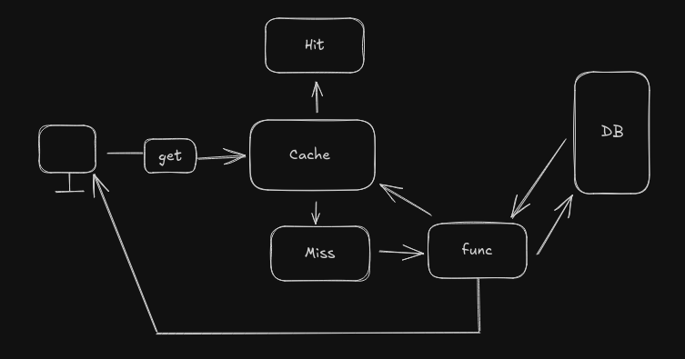

import Tabs from '@theme/Tabs';
import TabItem from '@theme/TabItem';

# Module 4 Algorithms in Action

---

## 4-1 Basic cache implementation with Map



```js title="Cache Simulation"
const dataCache = new Map();

const expensiveTask = (id) => {
    console.log("Ran the expensive task for:", id);
    return {
        id: id,
        data: `Some data for id: ${id}`,
        timestamp: new Date().getTime(),
    };
};

const getData = (id) => {
    if (dataCache.has(id)) {
        console.log("Cache HIT for id:", id);
        return dataCache.get(id);
    }
    console.log("Cache MISS for id:", id);
    const data = expensiveTask(id);
    dataCache.set(id, data);
    return data;
    console.log(dataCache);
    console.log(getData(123));
    console.log(getData(123));
    console.log(dataCache);
};
```

## 4-2,3,4,5

:::warning
Try to avoid nested loops to prevent `O(n^2)` time complexity.
:::

[Click Here To See Problems and Solution](https://github.com/Apollo-Level2-Web-Dev/critical-thinking/tree/main/module-04/solutions)

## 4-6 Binary Search Algorithm

```js {3} showLineNumbers title="PSEUDO Code Of binary Search"
 Algorithm BinarySearch(arr, target)

     low ← 0
     high ← length(arr) - 1

     while low ≤ high do
         mid ← floor (low + high) / 2

         if arr[mid] = target then
             return mid            // target found
         else if arr[mid] < target then
             low ← mid + 1         // search in right half
         else
             high ← mid - 1        // search in left half
         end if
     end while

     return -1                     // target not found

End Algorithm
```
