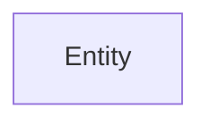

# Module 15: Database Fundamentals - Relational Data Modeling

---

## 15-1: Anatomy of a Database

### Entity

-   A thing or object that have independent existence.
-   Can have physical existence or conceptual existence only.
-   Represents people, things, events, locations or concepts within the Target System.
-   In ER Diagram, represented with a Rectangle.

Example: Student, Course, Enrollment, etc.

### Weak Entity

-   Do not have independent existence.
-   Always connected and dependent on other (Strong) entities.
-   May not have a key attribute.
-   Represented using a double rectangle.

**Example:** Enrollment, etc.

### Attributes

-   Properties that describe an entity.
-   These information or properties are required to operate the Target System.
-   Represented with an Oval in ER Diagram.

### Attributes - Simple and Composite

-   Composite: Can be divided into smaller parts. Example: Address, Name
-   Simple: Cannot be divided: age, email, age

### Attributes - Single-Valued and Multi-Valued

-   Single-Valued: Can have only one value. Age
-   Multi-Valued: Can have a set of values: Educational Certificate
    Use double oval for multi-valued attributes.

### Attributes -Complex

Complex = Composite + Multi-Valued

Shipping Address(City, State, Country, Addr Line 1)

### Attributes - Derived and stored

-   Stored: Independent information. Need to stored. e.g Date of Birth
-   Derived: Can/should be calculated from other attributes. e.g Age, Full-Name

### Attributes - Key Attributes

Attribute that identifies Entity uniquely - NID, Roll Number

-   Primary Key: The key attribute that is used to refer an Entity uniquely. e.g. NID, Student ID
-   Candidate Key: Key attributes other than Primary Key.
-   Composite Key: Primary key that was build with multiple attributes. e.g. ISBN+Member-ID

### Attributes - Null Values

When an attribute value -

-   Don't exists
-   Existence Unknown
-   Exists but missing

### Relationship

-   Describes purpose connection between entities
-   Represented with a Diamond in ER Diagram

### Relationship - Degree of Relationship

-   Unary: Linked to the Entity Type. e.g. Employee supervises Employee
-   Binary: Association among two entities. e.g. Publisher publishes Book
-   Ternary: Primary key that was build with multiple attributes. e.g. Teacher teaches Subject to Student

### Relationship - Cardinality Ratio

One To One, One To Many, Many To Many

### Relationship - Cardinality Ratio (Crows Foot)

### Relationship - Participation Constraints

Do All entities participate in the relationship?

-   Total Participation: All entities must participate in the relationship.
-   Partial Participation: Some entities may not participate in the relationship.

### Relationship - Associative/Intersection Entity

-   Generally occurs in Many to Many and Ternary relationships
-   Can have unique identifier and other attributes
-   Can have independent meaning

### Relationship - Generalization/Specialization

-   Generalization: An entity type that represents a general concept at a higher level.(Superclass)
-   Specialization: An entity type that represents a specific concept at a lower level.(Subclass)

### Relationship - Disjoint/Overlapping

-   Disjoint: An entity occurrence can be a member of only one subclass.(OR)
-   Overlapping: An entity occurrence can be a member of more then one of the subclasses.(AND)

### Diagram Notations

